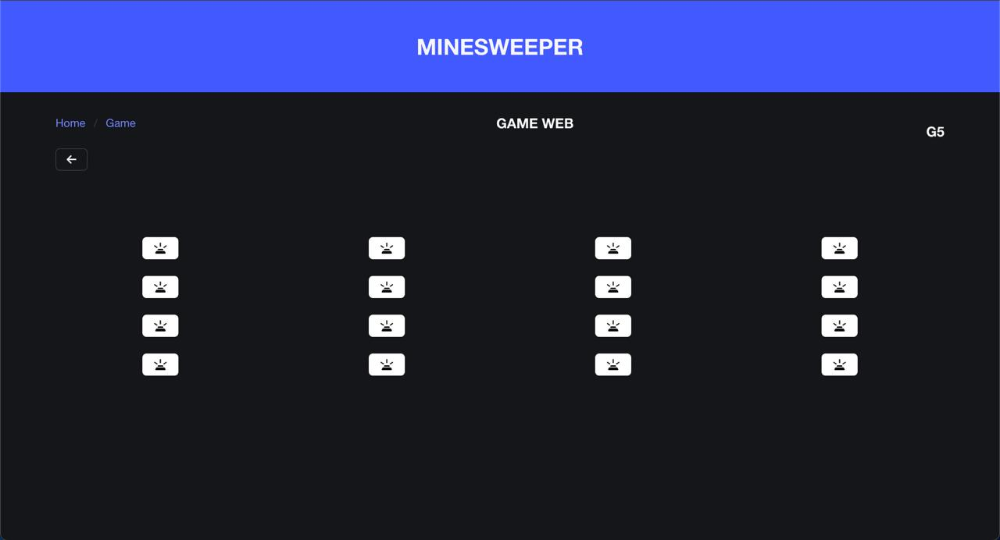

# 💣 Minesweeper Circuit — Web and Hardware Game with EEPROM & Bluetooth Control

## 📖 Table of Contents
1. [Project Overview](#-project-overview)
2. [Hardware Gallery](#-hardware-gallery)
3. [Web Interface](#-web-interface-vuejs)
4. [Backend System](#-backend-system-flask)
5. [Bluetooth Control](#-bluetooth-control)
6. [Digital Logic Design](#-digital-logic-design)
7. [Technical Stack](#-technical-stack)
8. [Getting Started](#-getting-started)
9. [Video Tutorial](#-video-tutorial)

 
  
[](https://github.com/marcosbondel/MinesweeperGame)
[](https://youtu.be/RoREA14uA2Y?si=5FYdEsazdJrEkiGc)

An interactive hardware version of **Minesweeper** featuring:
- 🖥️ **Vue.js Frontend** + **Flask Backend** for bomb configuration
- � **Digital Logic Design** with finite state machines
- 🧠 **Arduino Mega's EEPROM** memory storage
- 📶 **Bluetooth HC-06** wireless control
- 🎮 **Physical 4x4 LED/Button Matrix**

> 🎓 Developed as a final project for the **Organización Computacional** course  
> 🏛️ Universidad de San Carlos de Guatemala — Facultad de Ingeniería  
> ⏳ April 2025

---

## 📸 Hardware Gallery

### 🎮 Complete Game Board
  
  
*Featuring:*
- 16x LED game grid
- Custom mechanical keyboard
- LCD score display
- State indicator LEDs (🔵Playing/🔴Game Over/🟢Victory)

### 🔌 System Connections
  
*Arduino Mega 2560 connected via:*
- USB for direct programming
- HC-06 Bluetooth module
- Breadboard circuit with a 4x4 matrix red leds

---

## 🖥️ Web Interface (Vue.js)

<div align="center">
  
  
  
</div>

**Key Features:**
- Real-time bomb configuration
- Game statistics tracking
- Import/export bomb layouts
- Mobile-responsive design

```javascript
// Javascript for handling bombs and game status
export default class Ram {
    static bombs = []
    static matrix_representation = []
    static points = 0
    static configured = false
    static game_mode = ""
    static status = "not_started"

    static async fetchBombs(){
        const response = await fetch('http://localhost:3000/bombs.json');
      
        if (!response.ok) {
            console.log('Error fetching bombs:', response.statusText);
            return;
        }
        
        Ram.bombs = await response.json();
        console.log(Ram.bombs);
    }

    static async fetchMatrixRepresentation(){
        const response = await fetch('http://localhost:3000/bombs/matrix.json');
      
        if (!response.ok) {
            console.log('Error fetching matrix representation:', response.statusText);
            return;
        }
        
        // Ram.matrix_representation = await response.json();
        const response_json = await response.json();
        Ram.configured = response_json['configured'];
        console.log(Ram.configured);
        Ram.matrix_representation = response_json['matrix_representation'];
    }
}

```

---

## ⚙️ Backend System (Flask)

```python
# Flask API server configuration
class FlaskServer:

    def __init__(self):
        self.app = Flask(__name__)
        self.register_blueprints()
        CORS(self.app)
        self.app.register_error_handler(404, respond_with_not_found)
        self.app.register_error_handler(500, respond_with_error)
        self.app.register_error_handler(Exception, respond_with_error)
        self.read_db()
        self.setup_routes()

    def register_blueprints(self):
        self.app.register_blueprint(BombBlueprint)

    def setup_routes(self):

        @self.app.route('/')
        def index():
            return "Hello, World!"
        
        @self.app.route('/game/play.json', methods=['POST'])
        def play_game():
            Ram.play_game(request.get_json()['game_mode'])

            return respond_with_success("Game played successfully")
        
        @self.app.route('/game/top5.json', methods=['POST'])
        def top5():
            Ram.top5()

            return respond_with_success("Top 5 players retrieved successfully")

        @self.app.route('/game/reset.json', methods=['POST'])
        def reset_game():
            Ram.reset_backend()

            return respond_with_success("Reset successfully")

    def read_db(self):
        pass

    def run(self):
        self.app.run(host='0.0.0.0', port=3000, debug=True)
```

**Communication Flow:**
1. Vue frontend sends bomb coordinates via HTTP
2. Flask backend validates and converts to serial commands
3. Arduino stores configuration in EEPROM
4. Game state updates sent back via WebSocket

---

## 📶 Bluetooth Control

<div align="center">
  
  
</div>

**Wireless Features:**
- HC-06 module for wireless gameplay
- Standard SPP protocol (115200 baud)
- AT command configuration
- Cross-platform terminal support

**Example Commands:**
```bash
# Configure bombs
SET 0,0,1  # Set bomb at (0,0)

# Game control
MOVE 2,3   # Check position (2,3)
RESET      # Restart game
```

---

## � Digital Logic Design

### Finite State Machine


### EEPROM Memory Map
| Address Range | Content          |
|---------------|------------------|
| 0x000-0x00F   | Bomb positions   |
| 0x010-0x01F   | Game state       |
| 0x020-0x02F   | Player score     |

---

## 🛠️ Technical Stack

### Hardware
| Component       | Quantity | Purpose                     |
|-----------------|----------|-----------------------------|
| Arduino Mega    | 1        | Main controller             |
| Red Leds         | 16        | Bombs coordinates          |
| Red Led         | 1        | Gameover  status       |
| Blue Led         | 1        | Playing status          |
| Green Led         | 1        | Victory status          |
| Push Buttons | 16       | 4x4 input matrix            |
| HC-06           | 1        | Bluetooth communication     |

### Software
| Layer          | Technology       |
|----------------|------------------|
| Frontend       | Vue 3 + Vuetify  |
| Backend        | Flask + Python   |
| Arduino | ArduinoID + C++    |

---

## 🚀 Getting Started

1. **Arduino**

We used the Arduino IDE and upload the program as usual.

2. **Run Backend**
```bash
python3 ./app.py
```

3. **Start Frontend**
```bash
yarn install
yarn dev
```

4. **Pair Bluetooth**
Download the BluetoothLE app through AppStore

  
---

## ▶️ Video Tutorial

[](https://youtu.be/RoREA14uA2Y?si=5FYdEsazdJrEkiGc)

Watch our short tutorial demonstrating:
- Hardware setup walkthrough
- Web interface configuration
- Bluetooth pairing process
- Full gameplay demonstration
